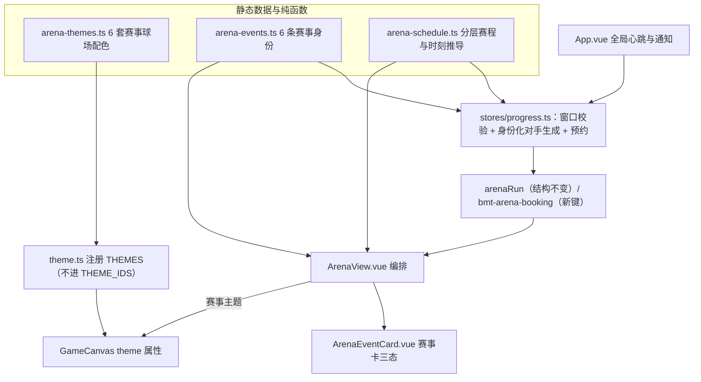

## 产品概述

晋级赛馆的报名分两步：先选级别（100 赛、200 赛……总决赛），进入某一级别后再从该级别的 6 个赛事名里挑一场报名。目前**同一级别内的 6 场赛事除了名字之外完全一样**：同样的开赛时间（随时可打）、同样的对手、同样的场地。本次要让这 6 场赛事各自拥有可辨认的身份与独立的开赛时刻，并同步下线理发店里的球场主题自选功能。

## 核心功能

- **赛事身份**：同一档内的 6 个赛事固定对应 6 套身份（场馆名 + 球场主题 + 对手阵容 + 一句话说明），每一档按同样的顺序循环：新手村、快攻营、防守派、速度队、老将组、综合赛。
- **独立开赛时刻（按档位分层）**：低档最密集（30 分钟一轮、同档 6 场每 5 分钟依次开赛、报名窗口 18 分钟），中档 90 分钟一轮（每 15 分钟一场、窗口 40 分钟），高档最稀有（180 分钟一轮、每 30 分钟一场、窗口 70 分钟）。因此同一档里 6 场赛事的开赛时间各不相同，档位越高越难凑时间。
- **三种状态的赛事卡**：未开赛（显示距开赛倒计时、按钮为「预约」）、报名窗口中（显示距截止倒计时、按钮为「报名」）、本场已结束（显示下一场倒计时）；该档处于冷却时优先显示冷却倒计时。
- **预约与到点自动开赛**：未开赛的赛事可提前预约（每档最多一条）；到点自动完成报名并提示，玩家不在晋级赛馆时用全局顶部提示条告知；若错过窗口、金币不足或已有进行中的一届，则清除预约并说明原因。已经报名进行中的一届随时可以继续打完，不受窗口限制。
- **赛事专属球场主题**：新增 6 套只用于赛事的球场配色，对局画面按该赛事的身份切换场地；不进入理发店的主题选项、不参与自动轮换。
- **对手阵容差异**：低档（100 赛至 400 赛）现场生成的弱手按身份重分配五维侧重并区分装扮档次（快攻营进攻高防守低、防守派相反、速度队速度与弹跳高、老将组技术高速度慢、新手村整体偏弱、综合赛最齐整）；高档（500 赛起）从名人堂名录里优先挑出符合该阵容风格的一批人组赛。同档内综合强度基本持平，卡面标注「对手偏弱 / 偏强」。
- **下线球场主题自选**：取消理发店里的球场主题选择与「每局结束自动换一个球场主题」，玩家不再需要（也无法）手动挑场地，场地由玩法与赛事决定。
- **赛程页与结算**：赛程页头部显示「赛事名 + 场馆 + 球场主题」；本届结束的弹窗里增加一块赛事海报（身份双色渐变 + 场馆名 + 赛事全名 + 名次）。
- **兼容性**：不改动已有存档字段，老存档里正在进行的这一届照常读取并正确显示场馆与阵容信息。

## 边界说明

- 不改报名费、奖励、赛制（局数 / 比分 / 球速）与对战判定。
- 不新增依赖；不触碰球类物理与判定代码。

## 技术栈

- 沿用现有栈：Vue 3 + TypeScript + Vite，Pinia（`@vueuse/core` 的 `useLocalStorage` 持久化），Vuetify 与项目自研 `src/components/ui/` 组件，Phaser 4 仅用于球场渲染。
- 新增 3 个纯数据 / 纯函数模块文件与 1 个展示组件，不新增任何依赖。
- 不触碰模拟层：`src/game/simulation.ts`、`src/game/config.ts` 不改；`src/game/scenes/GameScene.ts` 只删除主题轮换相关代码，物理与判定逻辑一行不动。

## 实现思路

把「赛事名」升级为可解析的**赛事身份**，把「开赛时间」交给**纯时间推导的赛程表**，两者都由静态表 + 纯函数提供，界面与对手生成读同一份事实来源。

1. **模块拆分（职责单一、互不依赖循环）**

- `src/game/arena-themes.ts`（新）：6 套赛事专属球场调色板，只导出 `ThemeDef` 片段与主题 id 常量；被 `theme.ts` 注册。
- `src/game/arena-events.ts`（新）：6 条赛事身份（场馆 / 说明 / 主题 id / 身份色 / 阵容类型 / 四维偏移 / 装扮档次）与按「档内 `names` 下标取模」的解析函数。
- `src/game/arena-schedule.ts`（新）：按档位分层的赛程表（周期 / 错开 / 窗口）与纯时间推导的状态机（开赛时刻、截止时刻、相位、下一场）。
- `src/components/ArenaEventCard.vue`（新）：赛事卡（身份色带 / 场馆 / 阵容标签 / 状态与倒计时 / 预约或报名按钮）。
- `src/views/ArenaView.vue`：只做编排与页面级展示，卡片逻辑下沉到组件。

2. **赛程完全由时间推导，不落库**
第 i 场赛事的开赛时刻 = `floor(now / cycle) * cycle + i * stagger`（epoch 对齐），窗口 = `[start, start + window)`。与 `chest.ts` 的 `chestPeriod()`、`world-arena.ts` 的届号同属一个范式：所有人算出来一致、刷新不变、不需要服务器，也不需要新增任何竞技存档字段。总决赛的名字池只有 5 个，索引取模即可天然兼容。

3. **预约用独立存储键**
新增 `bmt-arena-booking`（`Record<tier, { cupName, startAt }>`，每档最多一条），**不预扣费、不预建对阵树**（避免预约即占用本赛季，玩家在等待期仍可预约别的档）。到点由心跳调用 `tickArenaBooking()` 尝试 `enterArena(tier, name, cupName)`：成功即清预约并通知，失败（金币不足 / 已有进行中的一届 / 该档冷却 / 窗口已过）也清预约并写明原因。心跳放 `App.vue`（15 秒一次，并在 `visibilitychange` 恢复可见时补判一次），`App.vue` 现有的 `.toasts` 容器已经在渲染 `progress.notice`，通知无需新建设施。

4. **身份注入点只有一个**
赛程校验放在 `enterArena`（先定 `cupName`，再用同一个 `cupName` 调 `buildEntrants`），对手差异由 `buildEntrants` / `makeRookie` / `rookieCosmetic` 按身份实现；对手的打法由 `ai.ts` 从 `stats` 派生，所以**改四维就等于改打法**，无需碰任何模拟代码。

5. **主题注入点只有一个**
`GameCanvas` 的 `theme` 属性改为可选（默认 `'day'`），晋级赛传入该赛事的主题；其余玩法与场景统一使用默认日间。因为 `theme.ts` 的 `THEME_IDS` 是手写数组，新增的 6 套赛事主题**只注册进 `THEMES`、不加入 `THEME_IDS`**，天然不会出现在主题选择器与自动轮换里。

6. **下线主题自选**
删除理发店（`CustomizePanel.vue`）的「球场主题」一行与「每局结束自动换一个球场主题」开关、`BarberView.vue` 的主题快照与文案、`customize.ts` 的 `theme` / `autoCycle` 字段（含 `bmt-theme` / `bmt-theme-auto`），并清理 `GameCanvas` 的 `autoCycleTheme` / `themechange`、`GameScene` 的 `maybeCycleTheme()` / `onThemeChange`、6 个传入 `:theme="customize.theme"` 的页面绑定、`CharacterPreview` 的预览底色，以及 4 个非对局场景里的 `applyTheme(customize.theme)`。

**性能**：身份表与赛程表都是常量查表，O(1)；`buildEntrants` 规模不变（15 位对手），高档只多一次对不超过 20 个元素的稳定排序；每秒 tick 只重算倒计时（项目既有范式），15 秒心跳一次；无新增渲染循环、无新增网络消息、无每帧计算。

## 实现要点

- **`ARENA_TIERS[].names` 结构冻结**：它被 `pickCupName()`、`world-arena.ts` 的 `worldCupName()`、`career.ts` 的履历杯名共用，身份与赛程必须按「在本档 `names` 数组里的下标」索引（跨档重复的名字如「公开赛」「国际大师赛」因此不会错位）。
- **冷却仍按档位记**：继续沿用 `bmt-arena-cooldown` 与 `ARENA_COOLDOWN_MS`，不新增键；低档「5 分钟一场」的错开节奏与 5 分钟冷却恰好咬合，打完一场正好赶上下一场。
- **时间边界**：进行中的一届 `round > 0` 或已生成的 `arenaRun` 不做窗口校验，随时可继续；只有「新报名」受窗口限制。
- **资源与内存**：赛事卡按 6 个元素渲染，`v-for` 复用既有 `cup-card` 视觉骨架；倒计时统一走每页一个 1 秒 interval（与 `HallView` / `ShopView` 同款），不在组件内各自起表。
- **文案与提示**：到点通知走 `pushNotice`（4.2 秒自动消失），报名成功 / 失败沿用现有 `toastGood` / `toastWarn` 与 `enterArena` 的返回消息，不新增提示通道。
- **不回归**：世界赛（`world-arena.ts`）、生涯履历（`career.ts`）、名人堂球员的 `stats` / `cosmetic` 全部只读不改；去掉主题自选后，非对局场景仍会调用 `applyTheme` 保证画布调色板被初始化。

## 架构设计



数据单向流动：静态表（身份 / 赛程 / 主题）是唯一事实来源；报名写入既有 `arenaRun` 与新的 `bmt-arena-booking`；界面从 `tier` + `cupName` 反推同一身份与同一时刻。不引入新的架构模式，`ARENA_TIERS`、世界赛、生涯履历的既有读取路径完全不受影响。

## 目录结构

```
d:/Games/Badminton/
├─ src/game/arena-themes.ts          [NEW] 6 套赛事专属球场调色板。导出 6 个主题 id 常量与 THEMEDef 片段（skyTop/skyBottom/stands/crowd/apron/floor/floorStrip/floorEdge/line/post/netMesh/netTape/trail 等，只覆盖需要变色的键，其余继承 BASE）。纯数据，无副作用。
├─ src/game/arena-events.ts          [NEW] 赛事身份层。定义 EventPool（rookie/attack/defense/speed/veteran/open）与 ArenaEvent（key/label/venue/blurb/theme/art 双色/pool/bias/gear）；导出 ARENA_EVENTS 六条与 arenaEventOf(tier, cupName)、arenaEventIndexOf(tier, cupName)。解析必须按「本档 names 下标取模」，越界兜底第 0 条；不得改动 ARENA_TIERS。
├─ src/game/arena-schedule.ts        [NEW] 分层赛程。定义 EventPhase（upcoming/open/closed）与 EventSlot（index/startAt/closesAt/nextStartAt）；导出 scheduleTier(tier)（cycle/stagger/window 三档分层）、slotOf(tier, index, now)、phaseOf(slot, now)、countdown 粗细粒度格式化工具。纯时间推导，epoch 对齐，不读写存储。
├─ src/game/theme.ts                 [MODIFY] 扩展 ThemeId 联合类型并注册 6 套赛事主题到 THEMES（从 arena-themes.ts 引入调色板）；THEME_IDS 在无人使用后删除；applyTheme 逻辑与 BASE 不动。
├─ src/stores/progress.ts            [MODIFY] 报名与对手生成。新增 bmt-arena-booking 与 bookArena / cancelBooking / tickArenaBooking；enterArena 增加「本场是否在报名窗口内」校验，并把 cupName 先算好再传给 buildEntrants；buildEntrants 增加 cupName 参数并解析身份；makeRookie 叠加身份 bias；rookieCosmetic 按 gear 档次决定是否补翅膀/披风（仍严格只从 common/rare 取）；高档在既有候选切片内按 pool 做稳定优先排序，不改名人堂 stats/cosmetic；报名成功文案带场馆名。arenaRun 字段不变。
├─ src/components/ArenaEventCard.vue [NEW] 赛事卡组件。入参为赛事身份 + 档位信息 + 当前状态与时刻；渲染身份色带、场馆名、阵容标签与说明、状态行（距开赛 / 距截止 / 下一场 / 冷却）与按钮（预约 / 报名 / 已预约 / 不可报名）；向父级 emit book 与 signup。样式写在自身 scoped 段，只用现有 token。
├─ src/views/ArenaView.vue           [MODIFY] 页面编排。第二步用 ArenaEventCard 渲染 6 场赛事（用 nowTick 每秒驱动状态），第一步档位卡补一行阵容预览；赛程页头部加场馆与主题标签；对局改为传入赛事主题且不再回写玩家主题；结算弹窗加赛事海报；watch arenaRun 以便预约到点后自动切到赛程页。
├─ src/App.vue                       [MODIFY] 全局心跳。onMounted 起 15 秒 interval 调 progress.tickArenaBooking()，并监听 visibilitychange 恢复时补判一次；到点通知复用现有 progress.notice 提示条与 toastWarn。
├─ src/components/CustomizePanel.vue [MODIFY] 删除「球场主题」选择行与「每局结束自动换一个球场主题」开关，清理 THEMES / THEME_IDS 引入与 cz__theme 相关样式。
├─ src/components/CharacterPreview.vue [MODIFY] 预览底色与徽章改用固定默认主题，不再读 store.theme。
├─ src/components/GameCanvas.vue     [MODIFY] theme 属性改为可选（默认 day）；删除 autoCycleTheme 属性与 themechange 事件。
├─ src/game/scenes/GameScene.ts      [MODIFY] 删除 maybeCycleTheme()、autoCycleTheme / onThemeChange 配置项与 THEME_IDS 引入；保留 theme 属性与 applyTheme(this.currentTheme) 的初始化；物理与判定不动。
├─ src/views/BarberView.vue          [MODIFY] 移除 snap 里的 theme / autoCycle、restore() 的还原与「球场主题」相关文案。
├─ src/views/SingleView.vue          [MODIFY] 去掉 :theme / :auto-cycle-theme / @themechange 绑定。
├─ src/views/OnlineView.vue          [MODIFY] 同上。
├─ src/views/NailongView.vue         [MODIFY] 同上。
├─ src/views/HallView.vue            [MODIFY] 同上。
├─ src/views/WatchView.vue           [MODIFY] 同上。
├─ src/views/MineView.vue            [MODIFY] applyTheme(customize.theme) 改为默认主题。
├─ src/views/FishView.vue            [MODIFY] 同上。
├─ src/views/FarmView.vue            [MODIFY] 同上。
└─ src/views/ClimbView.vue           [MODIFY] 同上。
```

## 关键结构

```ts
// src/game/arena-events.ts：界面与对手生成共用的唯一契约
export type EventPool = 'rookie' | 'attack' | 'defense' | 'speed' | 'veteran' | 'open';

export interface ArenaEvent {
  key: string;
  /** 阵容标签（卡面胶囊）：新手村 / 快攻营 / 防守派 / 速度队 / 老将组 / 综合赛 */
  label: string;
  /** 场馆名（卡面 / 赛程页 / 海报） */
  venue: string;
  /** 一句话说明 */
  blurb: string;
  /** 该赛事绑定的球场主题（见 arena-themes.ts） */
  theme: ThemeId;
  /** 身份双色（0xRRGGBB，卡面色带与海报渐变） */
  art: [number, number];
  /** 阵容类型：低档重塑弱手四维，高档筛名人堂阵容 */
  pool: EventPool;
  /** 四维偏移（仅低档现场弱手使用） */
  bias: Partial<Record<'technique' | 'speed' | 'attack' | 'defense' | 'jump', number>>;
  /** 装扮档次：bare 只有帽/拍/拖尾；mixed 再补翅膀/披风（仍只 common/rare） */
  gear: 'bare' | 'mixed';
}

/** 按「本档 names 里的下标」解析；越界或找不到时兜底 ARENA_EVENTS[0] */
export function arenaEventOf(tier: string, cupName?: string): ArenaEvent;
```

```ts
// src/game/arena-schedule.ts：纯时间推导，不读写存储
export type EventPhase = 'upcoming' | 'open' | 'closed';

export interface TierSchedule {
  /** 一轮时长（同一档 6 场赛事共享一个周期） */
  cycle: number;
  /** 同档相邻两场的间隔 */
  stagger: number;
  /** 报名窗口时长 */
  window: number;
}

export interface EventSlot {
  index: number;
  /** 本场开赛时刻（毫秒时间戳） */
  startAt: number;
  /** 本场报名截止 */
  closesAt: number;
  /** 下一场开赛时刻 */
  nextStartAt: number;
}

/** 按档位分层：低档密集 / 中档常规 / 高档稀有 */
export function scheduleTier(tier: string): TierSchedule;
/** 第 index 个赛事在 now 所处的那个场次（epoch 对齐，刷新不变） */
export function slotOf(tier: string, index: number, now?: number): EventSlot;
export function phaseOf(slot: EventSlot, now?: number): EventPhase;
```

## 设计风格

沿用项目现有的 Soft UI Evolution 亮色外壳与奶黄液态玻璃质感，只重做晋级赛馆的两处：**赛事卡变成一张有身份的「赛程牌」**，**对局场地按赛事换配色**。不引入新的设计语言，不新增全局 token，卡面字体与间距全部沿用现有 `--ui-*` / `--s*` / `--r-*` / `--e*`。

视觉语言要点：一张赛事牌 = 顶部身份色带（两色渐变，横向 4px 高，圆角随卡片）+ 左侧身份色圆点 + 场馆名 + 阵容胶囊 + 一条时刻行 + 底部主按钮。身份色只出现在色带、圆点与胶囊描边上，卡片主体仍是白色软阴影，保持同一页面的秩序感。

## 六套赛事身份的视觉区分

| 身份 | 场馆 | 主题 id | 身份双色 | 场地倾向 |
| --- | --- | --- | --- | --- |
| 新手村 | 社区体育馆 | courtyard | #8FBF7A / #D9EBC9 | 暖白日间、地板浅绿 |
| 快攻营 | 城东进攻训练馆 | smashHall | #E4622F / #FFC79A | 橙红暖厅、界线偏深 |
| 防守派 | 老城区高远球馆 | highClearHall | #3D6FB8 / #A9C6EA | 靛蓝冷调、网带浅蓝 |
| 速度队 | 湖畔快腿中心 | lakeside | #1FA5A0 / #A8E4DF | 青绿水岸、地面偏亮 |
| 老将组 | 市体育馆老将专场 | veteranHall | #6A5AA8 / #C4B8EA | 深紫夜灯、观众席压暗 |
| 综合赛 | 中心竞技场 | grandArena | #C9962F / #F2DFA8 | 金色聚光、场地高对比 |


对局场地配色只覆盖球场相关键（天空 / 看台 / 围裙 / 地板 / 界线 / 网 / 拖尾），羽毛球与角色色保持 BASE 不变，确保每种底色下球与角色都清晰可辨；六套配色逐一核对地板与界线、网带、球的对比度。

## 页面与区块

1. **报名第一步：档位卡（改造既有 `cup-card`）**。原有档位名、门槛、报名费、奖励不动，底部补一行该档会遇到的 6 种阵容小胶囊（纯文字，颜色取对应身份色），让人一眼知道"点进去有什么"。
2. **报名第二步：赛事卡（新组件，6 张横滑）**。每张牌自上而下：身份色带；场馆名（16px 粗体）+ 身份色圆点；阵容胶囊（新手村 / 快攻营……）+ 一句话说明（12px 灰）；时刻行（距开赛 / 距截止 / 下一场，等宽数字字体 + 小图标位）；底部按钮（预约 / 报名 + 报名费）。三种状态用不同处理：`upcoming` 按钮为描边款写「预约」、时刻行显示「xx:xx 后开赛」；`open` 按钮为实心强调色写「报名」、时刻行显示「还有 xx:xx 截止」并在色带右端加一个呼吸小点；`closed` 按钮置灰写「本场已结束」、时刻行显示「下一场 xx:xx」。已预约的牌在色带上叠一条细的斜纹底并在按钮位显示「已预约 · 到点自动开赛」。
3. **赛程页头部**。在现有「赛事名 + 16 人单败 + 当前轮次」下补一行「场馆 · 球场主题名」，用身份色圆点与胶囊承载；整块沿用现有 `arena-head` 的分隔线与排版。
4. **结算弹窗**。在结果文案下方增加一块海报：上三分之二是身份双色斜向渐变，居中放赛事全名与场馆名；下三分之一是白底，放名次徽章（冠军 / 亚军 / 季军 / 8 强 / 16 强）、金币与积分收益。弹窗宽度沿用现有 `max-width`，海报高度约 120px，圆角与卡片一致。
5. **对局场地**。进入比赛后整块画面按该赛事主题着色；页面上不出现主题选择入口，玩家也无法在中途改主题。
6. **到点提示**。复用全局右上角提示条，文案形如「「萌芽杯」已在城东进攻训练馆开赛」，不做新组件。

## 交互与动效

- 卡片 hover 上浮 2px、描边换成身份色（沿用现有 `translateY(-2px)` + `border-color` 过渡曲线）；按下 `scale(0.98)`。
- 状态胶囊与呼吸点在 `open` 时才出现，1.6 秒一次缓慢明暗；`prefers-reduced-motion` 下全部关闭。
- 倒计时数字使用现有等宽数字字体，每秒刷新只重绘文本，不做位移动画，避免 6 张牌同时抖动。
- 预约成功后按钮位淡出为「已预约」文字，色带斜纹以 300ms 淡入。

## 响应式

- 桌面：6 张牌横向滚动容器（沿用现有 `cup-scroller` 的 `scroll-snap`），卡片宽 224px，高度自适应。
- 手机：卡片宽 200px，按钮撑满卡片宽度；时刻行与胶囊允许折行；横向滑动仍是唯一主交互，不做竖排。
- 全部尺寸为固定像素（与项目「所有设备布局一致」的约定一致），不按断点缩放。

## Agent Extensions

### Skill

- **ui-ux-pro-max**
- Purpose: 为 6 套赛事身份定一套可直接落地的视觉规范：赛事牌的色带位置与宽度、三种状态（未开赛 / 报名中 / 已结束）的按钮与胶囊样式、待开赛倒计时与已预约态的排版、赛程页头部标签的层级、结算海报的网格与文字对比度；同时校验 6 套球场配色下球场界线、网带、羽毛球与角色的对比度是否达标。
- Expected outcome: 产出 6 种身份互不混淆、且与项目现有奶黄液态玻璃外壳一致的视觉规范（每身份的身份色与用法、状态三态的组件样式、海报版式、六套场地配色的对比度结论），落地时只使用现有 `--ui-*` / `--s*` / `--r-*` / `--e*` / `--text*` token，不引入新的设计语言或依赖。