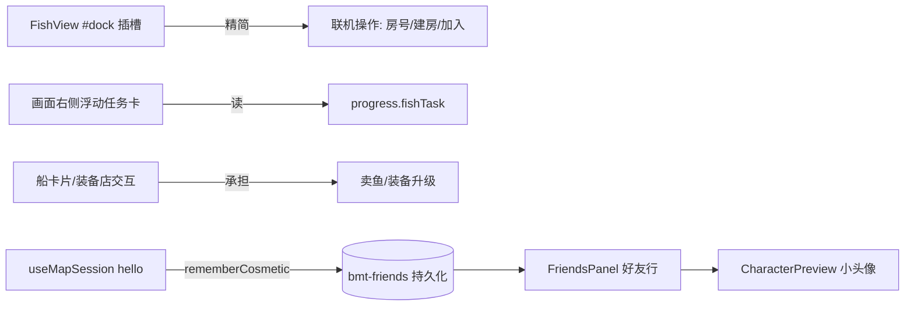

## Product Overview

对羽毛球游戏的「模式设置」面板与好友界面做针对性改版：让面板职责清晰（只留操作类功能），信息类内容回归游戏画面；好友列表可视化升级为带角色形象的卡片列表。

## Core Features

- **渔场「模式设置」瘦身**：每日钓鱼任务卡、卖鱼按钮、装备店入口全部移出 dock；卖鱼/装备升级只能在场景内建筑（岸上装备店小屋、栈桥的船）操作，dock 只保留联机类操作（房号输入、建房/加入、连接状态、操作说明）
- **每日任务浮动小卡**：任务卡改为画面右侧常驻/可折叠的浮动小卡（与船卡片同级），显示任务描述、进度条与领奖按钮，不占模式设置面板
- **好友列表角色化**：每行好友显示该好友的角色形象（画布小头像）+ 昵称 + 在线状态；角色装扮「见到就记住」——联机/同房见过一次就存入本地好友档案，没见过画默认形象
- **新增好友入口重构**：好友面板右上角一个「新增好友」按钮，点开收拢的添加区（我的好友码复制 + 输入对方好友码发送请求），沿用现有「对方接受后才互为好友」的确认流程
- 其他页面 dock 不动（本次只整改渔场这一页），服务端不改动

## Tech Stack

- 沿用项目现有栈：Vue 3 + TypeScript + Pinia + Vuetify + 自研 `ui/` 组件（Panel/Button/AppModal/StatusChip）
- 不新增任何依赖，不新增文件（改动集中在现有文件内），服务端 `server/lobby.mjs` 不动

## Implementation Approach

### Dock 瘦身（信息/操作分离）

- 原则：dock 只留「操作类」，信息类回归画面。渔场已有先例：出海/鱼图鉴本来就在画面内的 `boat-card`（站船边按 E 触发）
- `FishView.vue` 的 `#dock` 插槽精简为：房间状态 chip + 房号输入/建房/加入 + 操作说明；删除卖鱼按钮（`sell()` 移入船卡片，装备店弹窗由岸上按 E 的场景交互触发，与现有 `onBoat` 同模式）
- 每日任务卡从 dock 移到画面右侧浮动小卡：参照 `boat-card` 的定位与玻璃样式，常驻显示、可点击折叠，数据仍来自 `progress.fishTask`

### 好友装扮「见到就记住」

- `stores/lobby.ts` 的 `Friend` 接口扩展 `cosmetic?: Cosmetic` 字段；新增 `rememberCosmetic(id, cosmetic)` action：见到就写入并持久化到 `bmt-friends`（同引用需保持响应式，直接改数组内对象并触发 localStorage 同步）
- 挂点：`composables/useMapSession.ts` 收到 `hello` 时（已带 name + cosmetic，经 `sanitizeCosmetic` 清洗）调用；联机对战路径若同一挂点不便，则只在地图/同房链路挂一处（简单直接，够用）

### 好友面板改版

- `FriendsPanel.vue` 好友行改为：`CharacterPreview` 小头像（传 `f.cosmetic`，不传则不传 prop——组件自身会画默认形象？注意：不传 prop 会画**自己**的形象，需传 `f.cosmetic ?? undefined` 时组件回退为默认装扮；实现时给 CharacterPreview 加一个可传空装扮的方式或行内兜底）+ 昵称 + 在线圆点 + 邀请/删除按钮
- 添加区重构：默认收起，面板右上角「新增好友」按钮展开（`v-if` 切换），内部保留现有的好友码复制 + 输码 `requestFriend()` + 好友请求接受/忽略区

## Architecture Design

## Implementation Notes

- `CharacterPreview` 不传 `cosmetic` prop 会画「自己」而非默认形象，好友行必须显式处理「没见过装扮」的兜底（传空对象或加 `fallback-default` 分支），避免所有离线好友都长成玩家自己
- 任务浮动卡与船卡片可能同屏，注意右侧堆叠层级与不遮挡深度进度条；折叠状态可存 localStorage 或仅内存（选最简）
- `rememberCosmetic` 只写不删，重复收到同一装扮避免触发无意义的存储写入（浅比较后跳过）

## Design Style

延续项目现有「奶黄 Liquid Glass」软拟态风格：半透明白玻璃面板 + 双色内边 + 柔和阴影。好友行改为头像卡片式布局——左侧 48px 圆角方形画布头像（角色立绘，带在线绿点角标），中间昵称与在线场景，右侧动作按钮；「新增好友」为右上角小型强调按钮，点开展开内联添加区（玻璃输入框 + 发送按钮）。渔场任务浮动卡贴画面右侧、玻璃质感、可折叠成小药丸，展开时含任务标题、进度条与领奖按钮，与现有船卡片视觉同级。