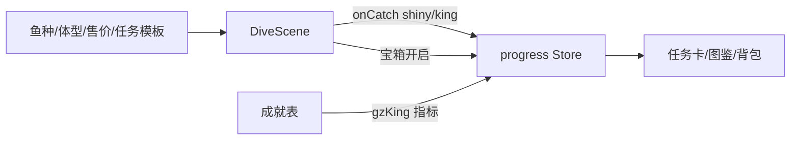

## 产品概述

对现有潜水钓鱼玩法（池塘）做一次全面升级，解决"鱼一样大、身上没装备、玩法单一"三个问题，并新增四个可选玩法系统。

## 核心需求

- **体型缩放**：同种鱼按体重在 0.6×~1.8× 之间平滑缩放，大鱼一眼可辨
- **装备上身高**：潜水员背后画氧气罐、腰间挂背包、手持鱼竿随渔具等级变大变花哨；**仅在钓鱼场景显示**，退出池塘不跟随其他场景
- **鱼王系统**：每个岛小概率刷出体型超大（接近 1.8× 上限且超过最大体重档）、游速更快的"鱼王"，抓住给高额奖励 + 专属成就
- **海底宝箱**：海里随机刷宝箱/沉船残骸，游过去拾取，开出金币 / 随机装扮 / 稀有鱼饵（稀有鱼饵 = 下次抓鱼必中闪光鱼的 buff，避免新增背包系统）
- **闪光鱼**：小概率刷出金色发光变体，价值翻几倍（约 ×5），抓到入图鉴特别标记
- **每日钓鱼任务**：每天随机任务（如"抓 3 条 20kg 以上的鱼 / 抓一条指定鱼种"），完成给金币+荣誉点，跨天自动刷新

## 视觉效果

- 潜水场景里鱼群大小错落有致，鱼王体型接近屏幕侧栏高度并带皇冠标记
- 闪光鱼周身金色光晕 + 粒子闪烁
- 潜水员背驮氧气罐、腰间背包、鱼竿竿身随等级加长并加装饰环
- 钓鱼页新增"每日任务"卡片（进度条 + 领取按钮）与宝箱开启的奖励提示

## 技术方案

### 技术栈

沿用现有项目栈：Vue 3 + TypeScript + Pinia + Phaser 3（场景）+ localStorage 持久化（useLocalStorage）。

### 实现思路

1. **体型缩放**：`fish.ts` 新增 `sizeScale(kg, sp)` 工具——按 `kg` 在 `sp.kg[0..1]` 区间的位置线性映射到 0.6~1.8；`DiveScene` 生成鱼时保留 kg，`drawFish` 处用 scale 绘制（emoji 字号 + 判定半径同步缩放，保证抓鱼手感一致）
2. **装备显示**：`DiveScene.drawDiver` 内新增三段绘制——氧气罐（背后胶囊+阀门，随 oxygenLv 换色）、背包（腰间圆角矩形，随 bagLv 变大）、鱼竿（竿身长度/装饰随 gearLv 递增，替换现有钩子线起点）；只在 DiveScene 的绘制路径里加，不碰 `draw/character.ts` 公共管线，天然满足"退出池塘消失"
3. **闪光鱼**：Fish 接口加 `shiny: boolean`，spawn 时按概率（约 3%）生成；`drawFish` 加金色描边+光晕+闪烁粒子；`fishValue` 乘 5；`onCatch` 上报 shiny；`fishLog` 扩展 `shiny` 计数字段（向后兼容：缺省 0）
4. **鱼王**：每岛一个"当前鱼王"槽位，每次 respawn 时小概率（约 5%）生成鱼王（kg 取物种上限、体型 1.8×、速度 ×1.4、flee 更高）；抓住给高额金币（物种售价 ×3）+ `achievements.ts` 新增"捕获鱼王"成就（基于新回调指标）
5. **宝箱**：DiveScene 新增宝箱实体数组（每岛同屏最多 1 个，间隔 20~40s 刷新在海底随机位置）；靠近按 E / 触屏点击拾取；开出金币 / 随机一件未拥有的 gacha 装扮（走 owned）/ 闪光鱼饵（progress 存 buff 时间戳，spawn 闪光鱼时若 buff 生效则必出闪光并消耗）；宝箱仅本机生成，不进联机同步
6. **每日任务**：`progress.ts` 新增 `fishTaskDay/fishTask/fishTaskProgress/fishTaskClaimed`（todayKey 模式）+ 任务生成器（模板池：按 kg 阈值抓 N 条 / 抓指定鱼种 1 条 / 抓 1 条闪光鱼）；`FishView` 侧栏加任务卡（进度/领取）；`DiveScene.onCatch` 回调里推进度
7. **性能**：鱼群渲染仍是每帧 Graphics 即时绘制，缩放只改乘法系数无额外开销；闪光鱼光晕用透明度正弦，不加粒子对象；宝箱同屏 ≤1，忽略不计

### 架构



### 目录结构

```
src/game/dive/
├── fish.ts              # [MODIFY] sizeScale / 闪光倍率 / 鱼王参数 / 任务模板池
└── DiveScene.ts         # [MODIFY] 体型缩放绘制、闪光鱼、鱼王生成、宝箱实体与拾取、装备贴图
src/stores/progress.ts   # [MODIFY] fishLog.shiny、闪光鱼饵 buff、每日钓鱼任务状态与领取
src/game/achievements.ts # [MODIFY] 新增鱼王/闪光鱼成就
src/views/FishView.vue   # [MODIFY] 每日任务卡 UI、图鉴闪光标记、宝箱奖励 toast
```

## Agent Extensions

### SubAgent

- **code-explorer**
- Purpose: 在实施前精确定位 DiveScene 中 drawFish 绘制、hook/reel 判定、onCatch 回调、drawDiver 鱼竿绘制等改动点的行号与签名
- Expected outcome: 输出各改动点的精确位置清单，避免改动遗漏（尤其是联机 fishPose 与 remote 鱼的缩放一致性）